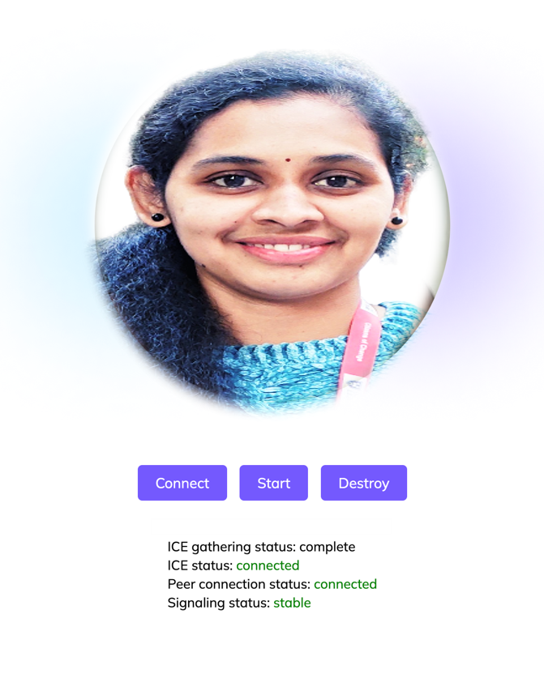

# Streaming Live Demo using Jay's face avatar and voice by D-ID

# How I created my face as an AI Digital Avatar for this application using D-ID

* Created a D-ID account and got 20 free credits.
* Click the "Create Video" Icon and Click the "Add" icon to add your face image.
* Add a script, language and voice in the D-ID Studio. (Only 10 words are allowed in the studio)
* If you need to add more words(script) and choose your desired voice options, click the API documentation in the sidebar.
* First, Generate your API Key and use Postman to do Basic authentication for creating your own face digital human avatar
* Then, to create a final digital avatar, the API request is sent using Postman by using the below JSON Script.
* The API id to create a talk: https://api.d-id.com/talks
* The API id to create a streams: https://api.d-id.com/talks/streams/{id}/sdp
* The API id to create an animation: https://api.d-id.com/animations
* "script": {
*   "type": "text",
*   "provider": {
*   "type": "elevenlabs",
*   "voice_id": "ThT5KcBeYPX3keUQqHPh"
*   }
* },
*  "config": {
*    "stitch": true
*    “mute”: false
*    },
*  "source_url":"https://create-images-results.d-id.com/google-oauth2%7C118122142916479891130/upl_vdo6WuNqxcNhdmVnMxJvq/image.jpeg"
*   "webhook": https://host.domain.tld/to/webhook
*   "driver_url": "bank://lively"
*   "driver_url": "bank://nostalgia/"
*   }

## How to deploy this app using Visual Studio Code on your device

* Create a new folder on your device.
* Download all the files in this repository and put all files in this folder.
* Open Visual Studio Code and open this folder you created.
* Open the file name "streaming-client-api.js" and run it.
* Click the Icon "Go Live" on the bottom right.
* Now, you can see the server started on your browser.

## Initial Setup with Express:
* (install express) Open a terminal in the folder and run  - npm install express
* (add your API key) Edit the `api.json` inside the uncompressed folder and replace the emoji with your key

## Start the demo:
* (bring up the app) in the folder (ctr left click on folder through finder) open the terminal run node app.js 
* You should see this message - server started on port localhost:3000
* (open the app) In the browser add localhost:3000
* (connect) press connect you should see the connection ready 
* (stream) Press the start button to start streaming

## App:

